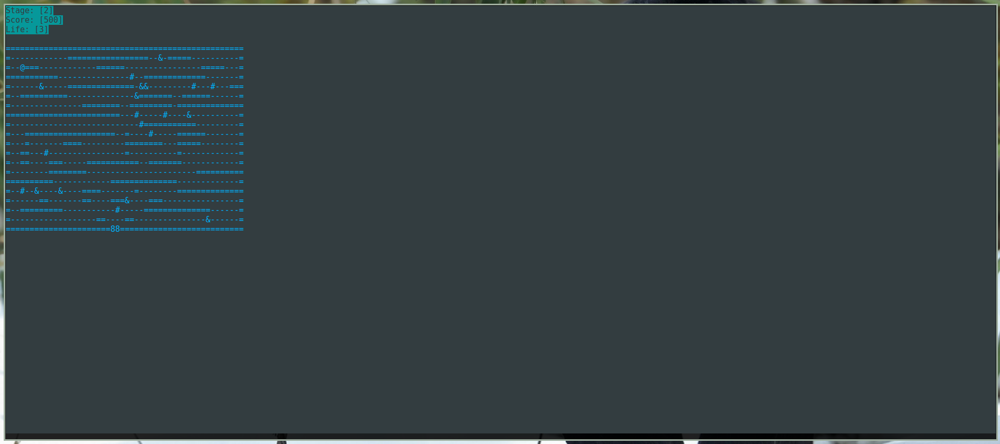

# aMAZEd Terminal

## About

This game is a project for the Object Orientation Programming course in [University of Brasilia](https://www.unb.br/).

Things to note before playing:

* The player is represented by the `@` symbol.

* Traps are represented by the `#` symbol, running into them will cause you to lose a life!

* Bonuses can and shall be caught as you find your way out, they look like this: `&`.

* The exit of the maze is the `8` on the map. That's your main goal!

In order to win, the player must reach the exit with a **positive score** and with at least 1 life remaning.

## Player controls

<kbd>W</kbd> or <kbd>↑</kbd> - move **up**

<kbd>S</kbd> or <kbd>↓</kbd> - move **down**

<kbd>A</kbd> or <kbd>←</kbd> - move **left**

<kbd>D</kbd> or <kbd>→</kbd> - move **right**

For the best experience, play with your terminal in fullscreen.

## Dependencies

For debian based(Ubuntu, Fedora, Debian, etc.):

`sudo apt-get install libncurses5-dev`

## Running the game

Clone the repo:

* `$ git clone https://github.com/gabrielziegler3/Maze-Game.git`

Move inside it and build it with Makefile.

* `cd Maze-Game && make`

Execute it:

* `make run`
